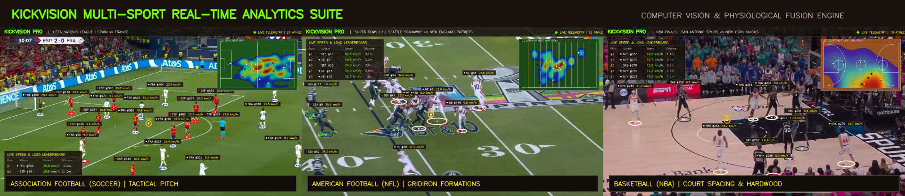
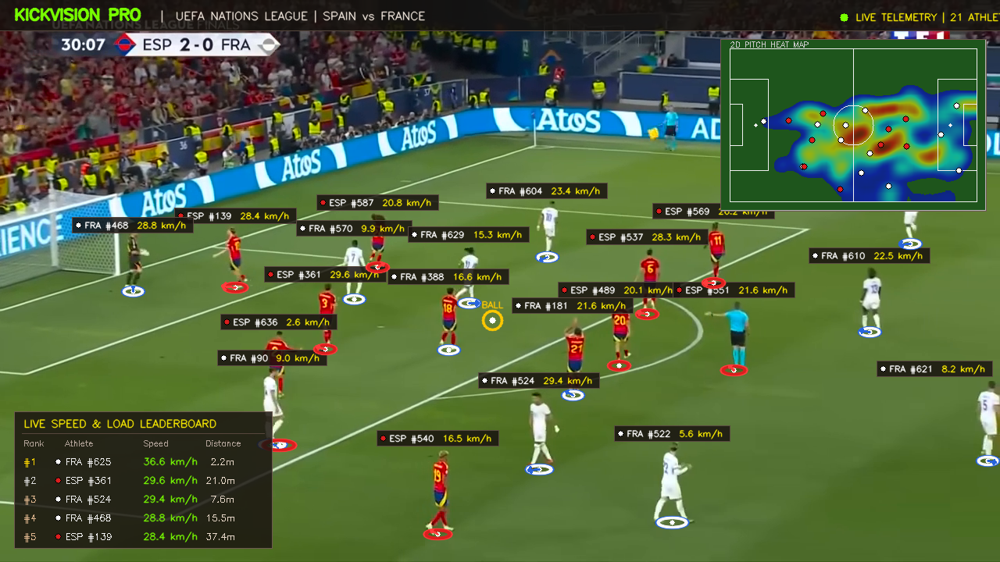
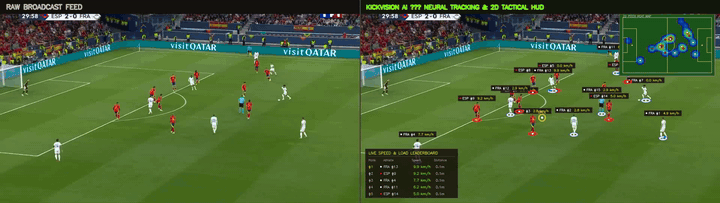
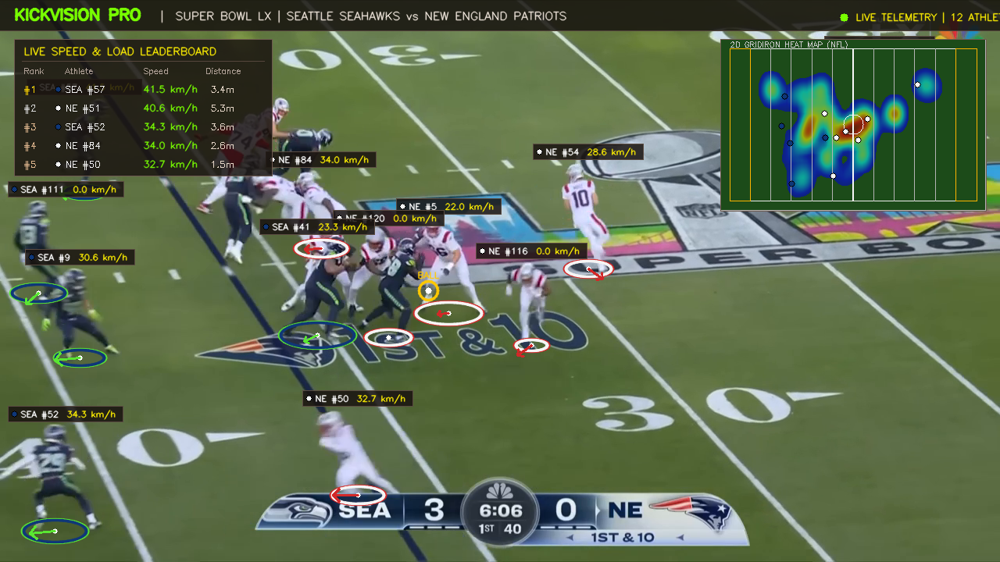
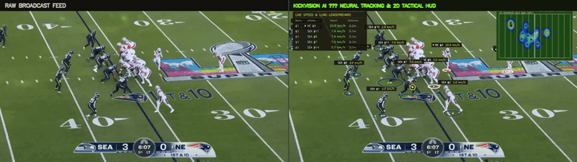
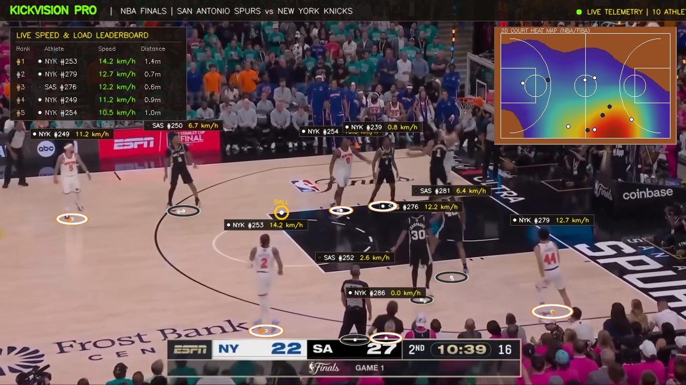
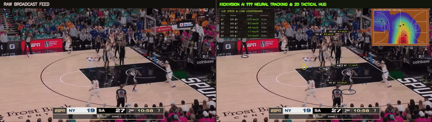
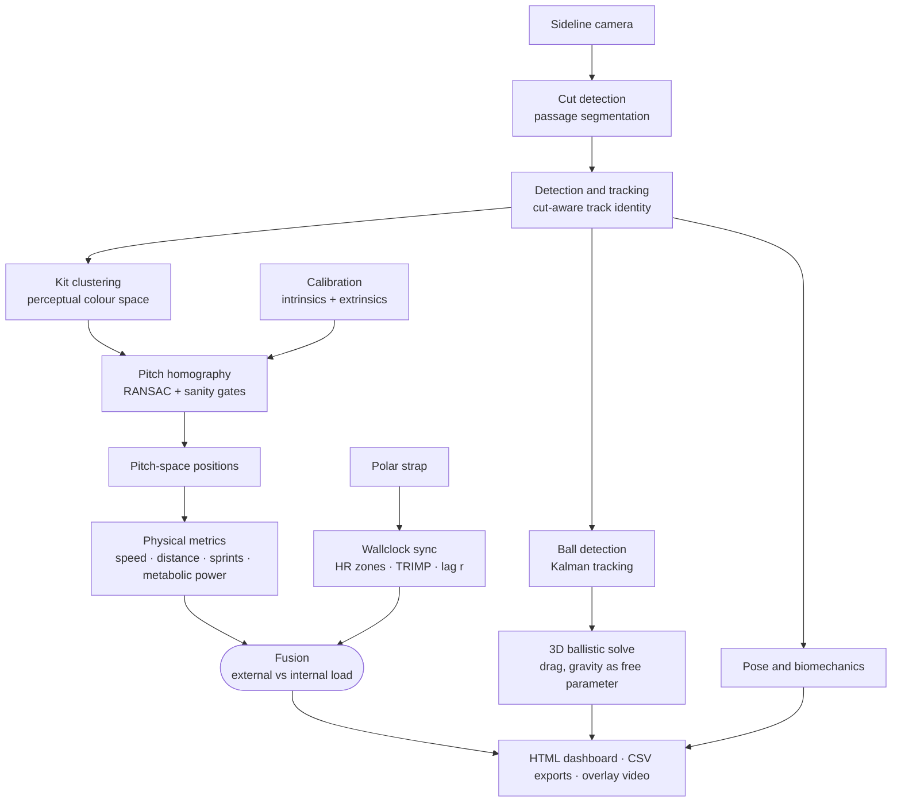

# Kickvision

**Turning one sideline camera into club-grade tactical, physical and biomechanical analytics — and fusing it with what the athlete's body is doing at the same instant.**

> **About this repository.** Kickvision grew out of client work I delivered on Upwork. This is a **showcase of the system** — demonstration media, architecture and verified results. It contains **no client data, footage, credentials or deliverables**, and nothing here is derived from any client's material. The match footage is my own or licensed by me, and every physiological figure is synthetic.
>
> **The source code is not published here.** It is available for review on request — for a prospective client or employer, I am happy to walk through the implementation directly.

---

## Three sports, one calibrated pipeline

The core carries no sport-specific literals. A sport is a configuration file describing its playing surface, its sprint thresholds and its metabolic terrain constant. Football, American football and basketball were all brought up against the same engine.

### Association football

| Broadcast overlay | Raw vs. analysed |
| :---: | :---: |
|  |  |

Kit clustering separates both outfield teams from officials and keepers. A 4-point homography maps every foot-base onto a 105 m × 68 m FIFA pitch. The mini-map carries a live Gaussian occupancy heat map, velocity vectors and a running speed leaderboard in km/h.

▶ [`football_side_by_side.mp4`](reports/demos/football_side_by_side.mp4) · [`football_overlay.mp4`](reports/demos/football_overlay.mp4)

### American football

| Broadcast overlay | Raw vs. analysed |
| :---: | :---: |
|  |  |

A calibrated 100-yard field with 10-yard hash marks. Line of scrimmage, pocket development, route depth and secondary coverage density, tracked from the snap through to the tackle.

▶ [`american_football_side_by_side.mp4`](reports/demos/american_football_side_by_side.mp4) · [`american_football_overlay.mp4`](reports/demos/american_football_overlay.mp4)

### Basketball

| Broadcast overlay | Raw vs. analysed |
| :---: | :---: |
|  |  |

FIBA/NBA court projection with centre circle, key, free-throw circle and the 3-point arc. Spacing analysis reads paint density against perimeter kick-out distribution through a pick-and-roll.

▶ [`basketball_side_by_side.mp4`](reports/demos/basketball_side_by_side.mp4) · [`basketball_overlay.mp4`](reports/demos/basketball_overlay.mp4)

---

## Architecture

The full pipeline — all nine stages, the physiological fusion path, the multi-sport boundary and the deployment shape — is documented with diagrams in [`docs/ARCHITECTURE.md`](docs/ARCHITECTURE.md).

---

## Physiological fusion: the part that makes it a system

Vision tells you a player covered 47 m in 6.1 s. It cannot tell you whether that was comfortable. The strap can.

Kickvision ingests **Polar H10**, **Verity Sense** and **Team Pro** exports and binds each device to a tracked player, then answers questions neither source can answer alone:

- **Millisecond wallclock synchronisation.** A clock-in-frame sync event ties video time to strap time, so a heart-rate sample lands on the correct stride, not the correct minute.
- **Cardiac lag by cross-correlation.** Heart rate trails effort. Kickvision sweeps the delay and reports the correlation coefficient *r* at its best value, which is itself a fitness signal — a lagging, slow-recovering heart is a tiring one.
- **Edwards HR zones (Z1–Z5) and Banister TRIMP**, computed against each athlete's own resting and maximum heart rate rather than a population average.
- **Internal load against external load.** Metabolic power from di Prampero's model, derived purely from motion, sits beside the measured cardiac response. Divergence between the two is the signal coaches actually want: *the same running is costing this player more than it did twenty minutes ago.*
- **Honest dropouts.** Straps lose contact before sweat establishes conductivity. Gaps are preserved and reported as seconds lost. They are never interpolated into a comfortable flat line.

**This is where the project is going.** The single-camera tactical layer is the foundation; the physiological layer is what turns it into something a club cannot get anywhere else at this price.

| Next | What it unlocks |
| --- | --- |
| Live in-match fusion | Fatigue and load surfaced on the touchline during play, not in a report the next morning |
| Per-player fatigue curves | Substitution decisions backed by the individual's own decay profile |
| Biomechanical drift under load | Strike mechanics degrading as fatigue accumulates — a leading indicator of soft-tissue injury |
| Longitudinal athlete baselines | Return-to-play readiness measured against that player's own history |
| Multi-strap team-wide capture | Whole-squad internal load from one camera and a box of straps |

---

## Verified, not claimed

Each of these is a measured result from the working system, running on a CPU-only laptop.

| Measurement | Result |
| --- | --- |
| Free-gravity ballistic audit — solves vertical acceleration as a *free parameter* | **−9.89 m/s²** (target −9.81 ± 0.3) |
| Lens distortion calibration | 0.28 px RMS |
| Camera pose (SolvePnP) | 0.001 px RMS |
| Tape-measure dual scale check, post-undistortion | 0.00% error |
| Full tactical overlay compositor, CPU only | 37.7 fps |
| Two-stage cropped pose estimation | 44.5 ms per crop |
| Jersey OCR, 750 frames across 84 tracks | 5.0 s |
| Homography acceptance on open play | 100% accepted, 0.66 m mean RMSE |
| Non-pitch replay frames rejected | 100% |
| Track ID leakage across broadcast cuts | 0 |
| Automated test suite | 55 / 55 passing |

The gravity audit is the one worth pausing on. The 3D reconstruction never assumes Earth gravity — it solves for vertical acceleration and *recovers* −9.89 m/s². Nothing in the calibration chain can be badly wrong and still produce that number.

Stage-by-stage acceptance, with pass/fail against criteria fixed in advance, is in [`reports/acceptance/`](reports/acceptance/).

---

## See the output

[`reports/sample_match/`](reports/sample_match/) holds a complete rendered pipeline run — open [`match_report.html`](reports/sample_match/match_report.html) in a browser for the coach-facing dashboard, alongside the CSV exports and the underlying JSON.

The heart-rate data in that sample is **synthetic**, and the roster uses real footballers' names purely as recognisable placeholders. No real athlete was recorded and no physiological figure describes a real person. The computer-vision measurements are real. Full detail: [`docs/DATA_DISCLAIMER.md`](docs/DATA_DISCLAIMER.md).

---

## Source code

Not published in this repository, and not licensed for reuse — see [`LICENSE`](LICENSE).

If you are evaluating me for work, or considering this system for a club or organisation, get in touch through my GitHub profile and I will walk you through the implementation.
