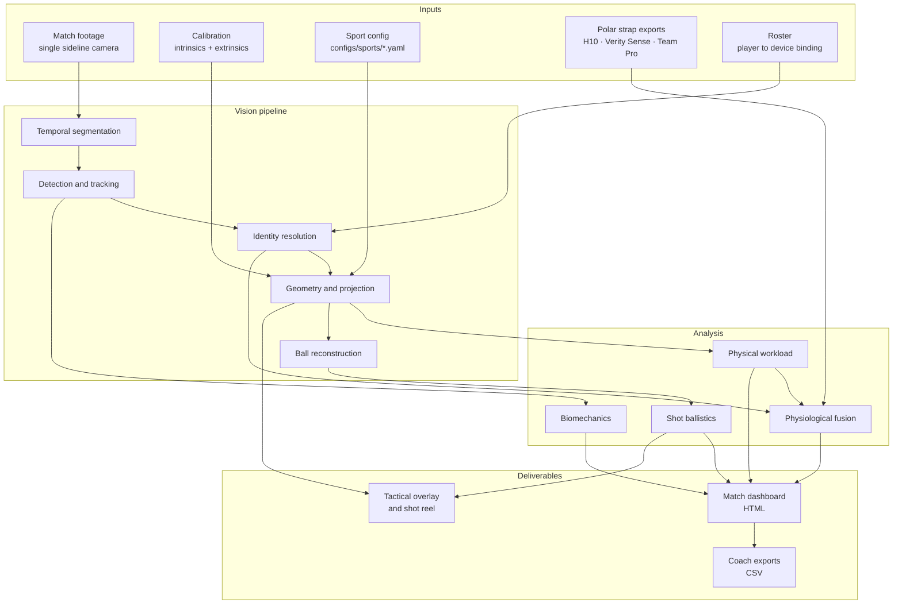
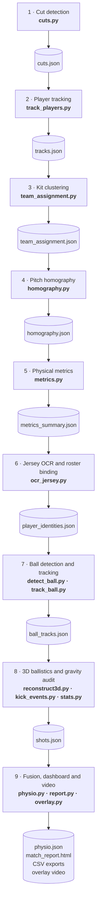
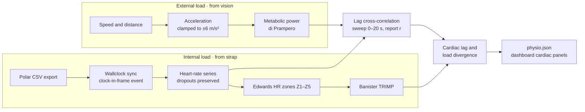
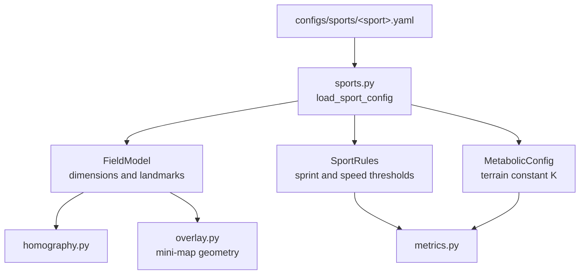
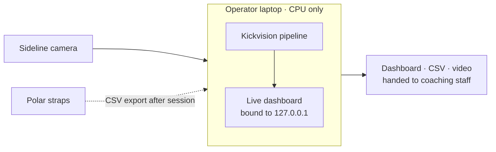

# Architecture

How Kickvision turns one sideline camera and a chest strap into a coach-facing report.

The guiding constraint is that **every stage writes its output to disk as a named artifact**. Nothing is held only in memory. That makes each stage independently runnable, resumable after a crash, inspectable when a number looks wrong, and testable without the stages around it. `kickvision process` is an orchestrator over nine such stages, not a monolith.

---

## System overview

---

## The nine stages

This is exactly what `kickvision process` runs, in order, with the artifact each stage leaves behind.

Every stage checks for its artifact before running and skips itself if the file is already present. `--force` overrides. On a laptop where stage 7 is the expensive one, this is the difference between a 20-second iteration and a full re-run.

### What each stage is actually solving

| # | Stage | The problem it exists to solve |
| --- | --- | --- |
| 1 | Cut detection | Broadcast cameras cut. A tracker that does not know this will carry a track ID across a cut and silently merge two different players. Passages are detected first so everything downstream can be namespaced by passage. |
| 2 | Player tracking | YOLO detection plus ByteTrack association. Track IDs are namespaced per passage, so a tracker reset at a cut boundary cannot collide with IDs from an earlier passage. |
| 3 | Kit clustering | Weighted k-means in CIE L\*a\*b\* space. Lightness is down-weighted against chromaticity, because raw L\* variance otherwise dominates and merges kits of similar brightness. Officials and keepers fall out as outliers. |
| 4 | Pitch homography | RANSAC fit from detected pitch keypoints to the sport's field model, gated on reprojection RMSE, condition number and circle circularity. The gates exist to reject replay and close-up frames that would otherwise yield a mathematically valid but physically absurd homography. |
| 5 | Physical metrics | Foot-base positions projected to pitch coordinates give speed, distance, sprint counts and zone occupancy. Speed is median-filtered and acceleration clamped to physiological bounds before entering the di Prampero metabolic model. |
| 6 | Identity | Upper-torso crops, dual-polarity Otsu binarisation and topological digit filtering propose jersey numbers; the roster binds a number to a player and a strap device ID. Video is read in a single forward pass rather than seeking per track. |
| 7 | Ball tracking | A pluggable `BallDetector` interface with two implementations, feeding a constant-velocity image-space Kalman filter with statistical gating and coasting through occlusion. |
| 8 | Ballistics | Image-space ball tracks plus calibration are solved into a 3D trajectory under quadratic aerodynamic drag. Vertical acceleration is a free parameter, not an assumption. |
| 9 | Fusion and delivery | Strap data is synchronised, fused with the motion-derived load, and everything is rendered into a dashboard, CSV exports and video. |

---

## Physiological fusion

The part that makes this a system rather than a tracker. Vision measures what the athlete did; the strap measures what it cost them.

Three decisions worth naming:

**Synchronisation is an event, not an offset.** A clock visible in frame ties video time to strap wallclock, so a heart-rate sample lands on the correct stride rather than the correct minute. Guessing an offset would put the whole analysis a few seconds out, which is exactly the scale of the effect being measured.

**Dropouts stay dropouts.** Chest straps lose contact before sweat establishes conductivity. Gaps are preserved and reported as seconds lost, never interpolated. A flat line through a gap looks like a calm athlete, which is the opposite of the truth.

**Lag is a measurement, not a nuisance.** Heart rate trails effort. Sweeping the delay and reporting the correlation at the best lag turns that trailing into a fitness signal in its own right: a heart that lags further and recovers slower is a tiring one.

---

## The multi-sport boundary

The core carries no sport-specific constants. A sport is data.

Adding a sport means writing a YAML file. Football on grass, American football on turf and basketball on hardwood differ in field dimensions, sprint threshold and the di Prampero terrain constant, and all three are expressed as configuration rather than branches in the pipeline.

---

## Module reference

| Module | Role |
| --- | --- |
| `capture.py` · `probe.py` | Camera acquisition, mode probing, locked exposure, frame-latency audit |
| `calibrate_intrinsics.py` | Brown-Conrady lens distortion from checkerboard captures |
| `calibrate_pitch.py` | Camera pose via SolvePnP, tape-measure scale verification |
| `cuts.py` | Broadcast cut detection and passage segmentation |
| `detect.py` · `detect_players.py` | YOLO player detection with tiling and NMS |
| `track_players.py` | ByteTrack association, cut-aware ID namespacing, ID-switch measurement |
| `team_assignment.py` | Weighted Lab k-means kit clustering, official and keeper outlier detection |
| `homography.py` | Pitch keypoints, RANSAC homography, geometric sanity gates |
| `metrics.py` | Speed, distance, sprints, speed zones, di Prampero metabolic power |
| `detect_ball.py` · `track_ball.py` | Pluggable ball detectors, image-space Kalman filter with gating |
| `reconstruct3d.py` | 3D ballistic solve with drag and free-parameter gravity |
| `kick_events.py` | Sub-frame contact detection and kick attribution |
| `stats.py` | Shot analysis with confidence intervals and rejection reasons |
| `pose.py` · `technique.py` | Two-stage cropped pose estimation, kicking biomechanics time series |
| `ocr_jersey.py` | Jersey number OCR and roster identity binding |
| `physio.py` | Polar ingestion, synchronisation, HR zones, TRIMP, lag correlation |
| `overlay.py` | Tactical HUD compositor, mini-map heat map, live leaderboard |
| `report.py` | HTML dashboard, CSV exports, presentation reel rendering |
| `sports.py` | Sport configuration boundary |
| `cli.py` · `live.py` | Pipeline orchestration and live loopback dashboard |

---

## Deployment shape

Everything runs on one CPU-only laptop. There is no server, no account and no upload step. The live dashboard binds to loopback by default and only reaches the local network if explicitly asked with `--web-host`. Footage, calibration, roster and strap data are read from disk and written back to disk on the same machine, which is a deliberate property when the input is athlete physiological data.

See `PRIVACY_AND_TELEMETRY.md` for what the dependency stack does about this, and `ONBOARDING.md` for bringing a venue online.
